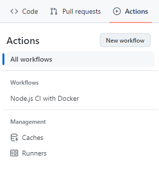
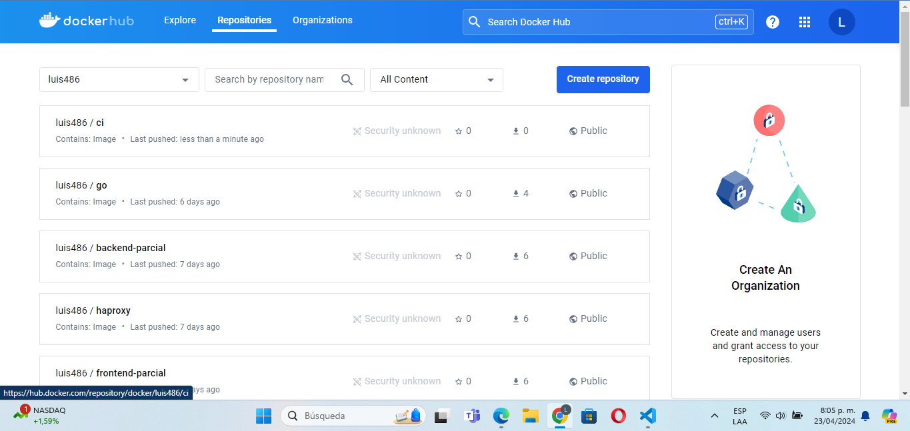

### Nuestro primer pipeline

### Requisitos 

- Haber creado un secrets en github para guardar las contraseñas de dockerhub (como son datos sensibles, es necesario)

#### Pasos

1. Se debe crear la imagen de Dockerfile que contenga el código de la aplicación de javascript (en este caso Rick y morty)

2. Luego se debe verificar que la aplicación esté corriendo primero en local, para ello se hacen los pasos de npm install (que nos trae todas las dependencias en la caprrta node_modules) y npm run dev para lanzar la aplicación en local por el puerto 3000

3. Ahora si, si tenemos nuestro Dockerfile funcionando, podemos pasar a crear el github actions.

4. En la pestaña de actions creamos un nuevo workflow y elegimos el que más nos convenga de acuerdo a nuestra situación (tenemos muchas plantillas para elegir)

5. Luego de eso pasamos a la construcción del Pipeline (claramente de acuerdo las funciones que necesites) en este caso los pasos para esta vez son 
    
    1. Instalar las dependencias
    2. Construir la imagen
    3. Pushear la imagen en tu repo de dockerhub

    
    
    

6. Listo, si creaste bien tu pipeline, deberías revisar tu repo de dockerhub y ahí tener tu imagen.

**Felicidades, lo hiciste**

        

